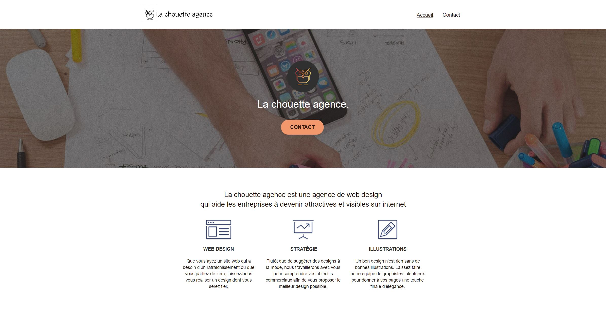

# Welcome to La chouette agence 👋  

A website has been given to me, my mission was to improve SEO and accessibility -> WCAG AA  
You can found the original code in branch old  
Remasterized code is in branch master  

This work is from my computer science school 🏫 https://openclassrooms.com  
Any feedbacks are appreciated

### 🏠 [Homepage](https://axeldevisse.github.io/chouette-agence/index.html)

## 🔨 Used in this project

* HTML5
* CSS3
* JS
* BOOSTRAP
* GIT

## Author

👤 **Axel Devisse**

* Website: notime :D
* Twitter: [@kavije](https://twitter.com/kavije)
* Github: [@AxelDevisse](https://github.com/AxelDevisse)
* LinkedIn: [@Axel Devisse](https://linkedin.com/in/axel-devisse-253941195/)
* Mail : axeldevisse@gmail.com 💬

Thanks for reading ❤️